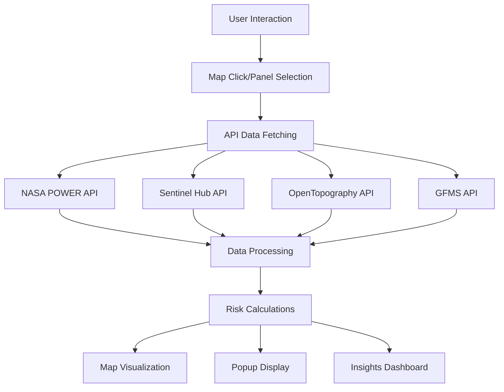

# Climate Risk Prediction and Visualization Platform

A comprehensive Next.js application for climate risk assessment and visualization, specifically designed for Rwanda. This platform combines multiple data sources to provide real-time flood risk, drought risk, and flood prediction analysis with interactive map visualization.

## video demo
([video Link](https://drive.google.com/drive/folders/1s9kWNpgV6TT5-AhVbj-o02ZuN0vgTGyM?usp=sharing))

## Features

### Core Functionality

- **Flood Risk Assessment**: Combines NASA POWER rainfall data with OpenTopography elevation/slope analysis
- **Drought Risk Monitoring**: Integrates precipitation deficit, temperature anomalies, and vegetation health (NDVI)
- **Flood Prediction**: Uses past rainfall trends to predict future flood risk (7-day forecast)
- **Interactive Map Visualization**: Toggle-able risk layers with semi-transparent overlays
- **Comprehensive Popups**: Click any location to see detailed climate data and risk scores

### Data Sources

- **Sentinel Hub**: NDVI, NDWI, vegetation health monitoring
- **NASA POWER**: Temperature, precipitation, climate data
- **OpenTopography**: Elevation, slope, terrain analysis
- **Mapbox**: Map visualization and rendering
- **GFMS**: Historical flood events (optional)
- **NISR Geospatial data portal**: Geojson data for local contexts

## Quick Start

### Prerequisites

- Node.js 18+
- npm or yarn
- API keys for external services (see setup below)

### Installation

1. **Clone the repository**

```bash
git clone <repository-url>
cd i-si
```

2. **Install dependencies**

```bash
npm install
# or
yarn install
```

3. **Set up environment variables**

```bash
cp env.txt .env.local
```

4. **Configure API keys** (see API Setup section below)

5. **Run the development server**

```bash
npm run dev
# or
yarn dev
```

6. **Open your browser**
   Navigate to [http://localhost:3000](http://localhost:3000)

## API Setup

### Required Environment Variables

Create a `.env.local` file in the root directory with the following variables:

```bash
# Mapbox Configuration (Required)
NEXT_PUBLIC_MAPBOX_TOKEN=your_mapbox_token_here

# NASA POWER API (No key required - public API)
NEXT_PUBLIC_NASA_POWER_BASE_URL=https://power.larc.nasa.gov/api/

# Sentinel Hub API (Required for satellite data)
NEXT_PUBLIC_SENTINEL_HUB_INSTANCE_ID=your_sentinel_hub_instance_id
NEXT_PUBLIC_SENTINEL_CLIENT_ID=your_sentinel_client_id
NEXT_PUBLIC_SENTINEL_CLIENT_SECRET=your_sentinel_client_secret

# OpenTopography API (No key required - public API with rate limits)
NEXT_PUBLIC_OPENTOPOGRAPHY_API_URL=https://cloud.sdfi.dk/api/

# Default Map Center (Rwanda)
NEXT_PUBLIC_DEFAULT_LAT=-1.9403
NEXT_PUBLIC_DEFAULT_LNG=29.8739
NEXT_PUBLIC_DEFAULT_ZOOM=8

# App Configuration
NEXT_PUBLIC_APP_NAME=I-si
NEXT_PUBLIC_APP_DESCRIPTION=Climate Risk Prediction and Visualization Platform for Rwanda
```

### API Key Setup Instructions

#### 1. Mapbox (Required)

1. Go to [Mapbox](https://www.mapbox.com/)
2. Create a free account
3. Navigate to your [Account page](https://account.mapbox.com/)
4. Copy your **Default public token**
5. Add it to `.env.local` as `NEXT_PUBLIC_MAPBOX_TOKEN`

#### 2. Sentinel Hub (Required for satellite data)

1. Go to [Sentinel Hub](https://www.sentinel-hub.com/)
2. Register for a free account
3. Create a new instance:
   - Go to "Instances" → "Create new instance"
   - Choose "Sentinel-2 L2A" as the data source
   - Configure your instance settings
4. Get your credentials:
   - **Instance ID**: Found in your instance settings
   - **Client ID**: Found in "OAuth clients" section
   - **Client Secret**: Found in "OAuth clients" section
5. Add them to `.env.local`

#### 3. NASA POWER (No setup required)

- Public API with no authentication required
- Rate limits: 1000 requests per day
- Data available globally with 0.5° resolution

#### 4. OpenTopography (No setup required)

- Public API with no authentication required
- Rate limits: 1000 requests per day
- Provides global elevation data (SRTM, ASTER, etc.)

## Project Structure

```
src/
├── app/                          # Next.js app router
│   ├── (routes)/                 # Route groups
│   │   ├── insights/             # Climate insights dashboard
│   │   └── map/                  # Interactive map page
│   └── api/                      # API routes
├── components/                   # Reusable UI components
│   ├── ui/                       # Base UI components (shadcn/ui)
│   ├── charts/                   # Data visualization components
│   ├── MapLayers.tsx             # Map layer rendering logic
│   └── ClimateRiskPopup.tsx      # Map popup component
├── lib/                          # Core library code
│   ├── api/                      # API client implementations
│   │   ├── nasa-power.ts         # NASA POWER API client
│   │   ├── sentinel-hub.ts       # Sentinel Hub API client
│   │   ├── opentopography.ts     # OpenTopography API client
│   │   └── gfms.ts               # GFMS flood API client
│   ├── data/                     # Data processing and calculations
│   │   ├── flood-risk-index.ts   # Flood risk calculations
│   │   ├── drought-risk-index.ts # Drought risk calculations
│   │   └── flood-prediction.ts   # Flood prediction algorithm
│   └── hooks/                    # Custom React hooks
├── hooks/                        # Additional custom hooks
└── types/                        # TypeScript type definitions
```

## Risk Calculation Algorithms

### Flood Risk Index

Combines multiple factors with weighted scoring:

- **Rainfall Intensity (35%)**: Recent precipitation, intensity trends, antecedent moisture
- **Terrain Characteristics (30%)**: Elevation, slope, topographic wetness index
- **Vegetation Cover (15%)**: NDVI-based runoff potential
- **Historical Flood Frequency (20%)**: Past flood events and seasonal patterns

### Drought Risk Index

Multi-factor drought assessment:

- **Precipitation Deficit (40%)**: Recent vs. historical rainfall patterns
- **Temperature Anomaly (25%)**: Temperature trends and heat stress
- **Vegetation Health (25%)**: NDVI-based vegetation stress
- **Soil Moisture (10%)**: NDWI-based soil moisture indicators

### Flood Prediction Score

Time-based flood risk forecasting:

- **Recent Rainfall (40%)**: Last 7 days rainfall sum and trends
- **Historical Patterns (30%)**: Seasonal risk and historical flood frequency
- **Terrain Factors (20%)**: Elevation, slope, drainage characteristics
- **Vegetation Cover (10%)**: NDVI-based runoff potential

## Map Layers

### Available Layers

1. **Flood Risk**: Real-time flood risk assessment
2. **Drought Risk**: Current drought conditions
3. **Flood Prediction**: 7-day flood risk forecast
4. **Vegetation Health (NDVI)**: Satellite-based vegetation monitoring
5. **Rainfall Anomaly**: Precipitation pattern analysis

### Layer Controls

- Toggle layers on/off
- Adjust opacity (default: 0.6)
- Time range selection (7d, 30d, 90d, 1y, 5y)
- Map style switching (Street, Satellite, Hybrid)

## Data Flow



## Technologies Used

### Core Framework

- **Next.js 15**: React framework with App Router
- **TypeScript**: Type-safe development
- **Tailwind CSS**: Utility-first CSS framework

### Map & Visualization

- **Mapbox GL JS**: Interactive map rendering
- **React Map GL**: React wrapper for Mapbox
- **Recharts**: Data visualization charts

### Data & APIs

- **Axios**: HTTP client for API requests
- **TanStack Query**: Data fetching and caching
- **Date-fns**: Date manipulation utilities

### UI Components

- **shadcn/ui**: Modern UI component library
- **Lucide React**: Icon library
- **React Hot Toast**: Toast notifications

## API Documentation

### NASA POWER API

- **Endpoint**: `https://power.larc.nasa.gov/api/`
- **Parameters**:
  - `lat`, `lon`: Coordinates
  - `start`, `end`: Date range (YYYYMMDD)
  - `parameters`: Data types (T2M, PRECTOTCORR, etc.)
- **Rate Limit**: 1000 requests/day
- **Resolution**: 0.5° global grid

### Sentinel Hub API

- **Endpoint**: `https://services.sentinel-hub.com/api/v1`
- **Authentication**: OAuth 2.0 with client credentials
- **Data Sources**: Sentinel-2 L2A, Sentinel-1
- **Processing**: Custom evalscripts for NDVI, NDWI calculation

### OpenTopography API

- **Endpoint**: `https://portal.opentopography.org/API/globaldem`
- **DEMs Available**: SRTMGL3 (90m), SRTMGL1 (30m), AW3D30
- **Rate Limit**: 1000 requests/day
- **Output Formats**: GeoTIFF, AAIGrid, HFA

## Error Handling

The application includes comprehensive error handling:

- **API Failures**: Graceful degradation with fallback data
- **Network Issues**: Retry logic with exponential backoff
- **Data Validation**: Type checking and data quality assessment
- **User Feedback**: Loading states and error messages

## Troubleshooting

### Common Issues

1. **Map not loading**

   - Check Mapbox token in `.env.local`
   - Verify token has correct permissions

2. **No satellite data**

   - Verify Sentinel Hub credentials
   - Check instance configuration
   - Ensure evalscript is properly formatted

3. **API rate limits**

   - NASA POWER: 1000 requests/day
   - OpenTopography: 1000 requests/day
   - Implement caching for production use

4. **Build errors**
   - Run `npm run build` to check for TypeScript errors
   - Ensure all environment variables are set
   - Check API endpoint URLs

### Performance Optimization

- **Data Caching**: TanStack Query provides automatic caching
- **Lazy Loading**: Components load on demand
- **Image Optimization**: Next.js automatic image optimization
- **Bundle Analysis**: Use `npm run analyze` to check bundle size

## Contributing

1. Fork the repository
2. Create a feature branch (`git checkout -b feature/amazing-feature`)
3. Commit your changes (`git commit -m 'Add amazing feature'`)
4. Push to the branch (`git push origin feature/amazing-feature`)
5. Open a Pull Request

## License

This project is licensed under the MIT License - see the [LICENSE](LICENSE) file for details.

## Acknowledgments

- **NASA POWER**: Climate data provided by NASA Langley Research Center
- **Sentinel Hub**: Satellite imagery processing platform
- **OpenTopography**: Global elevation data services
- **Mapbox**: Map visualization platform
- **Rwanda**: Focus region for climate risk assessment

## Support

For support and questions:

- Create an issue in the GitHub repository
- Check the troubleshooting section above
- Review API documentation for specific services
